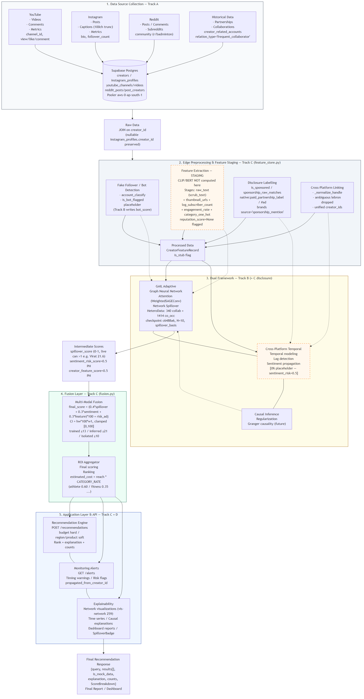
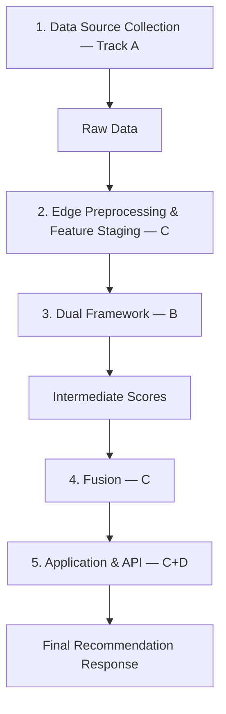
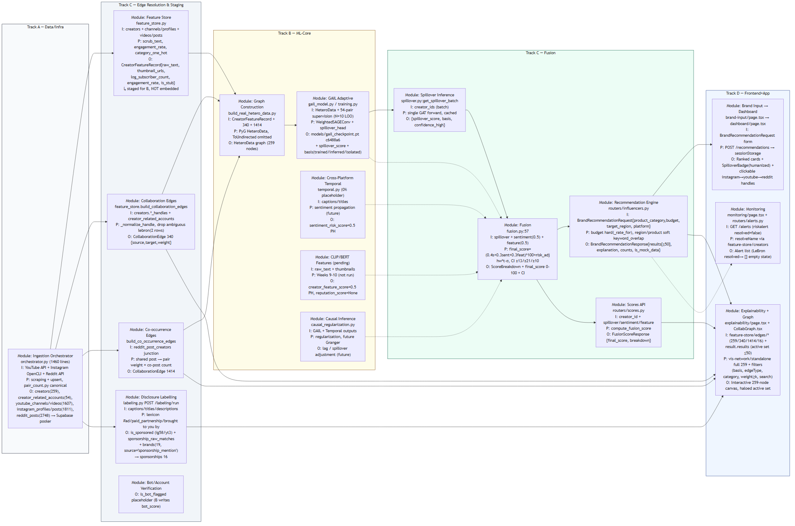
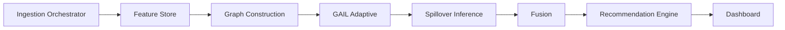
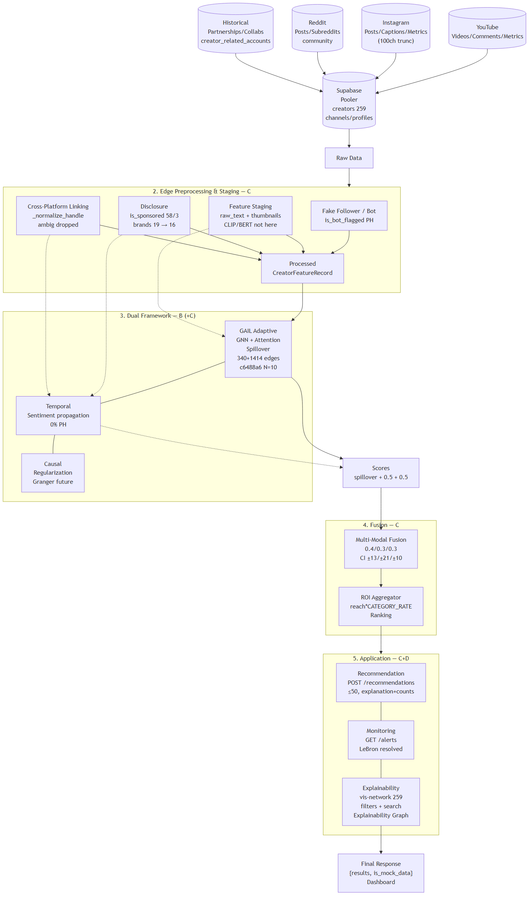

# Task 1 — Architecture Figure Analysis & Corrected Diagrams

## Is the Uploaded Image Correct?

**No — it is a conceptual sketch, not the as‑built `review-1` module interdependency figure.** It captures the 5-box intent (1 Data → 2 Preprocessing → 3 Dual Framework → 4 Fusion → 5 Application) but fails on 8 verifiable points against `D:\Capstone` `review-1` (`CAPSTONE_NEXT_STEPS.md`, `PROJECT_PLAN.md`, `GRAPH_SCHEMA.md`, `API_CONTRACTS.md`, `backend/app/*`, `frontend/src/*`, live `GET /feature-store/edges/*`).

| # | Uploaded image says | As‑built reality (`review-1`, verified 2026‑08‑27) | File / route |
|---|---|---|---|
| 1 | Data sources: YouTube + Instagram + Historical | **Also Reddit** (`reddit_posts/post_creators`, `co_occurs_with` 1,414 edges via `r/badminton` shared subreddit). All three feed **Supabase Postgres** pooler `aws-0-ap-south-1` — image shows no DB. | `backend/.env` DATABASE_URL, `AGENTS.md:3` |
| 2 | `CLIP visual / BERT text embeddings` inside Edge Preprocessing as computed | **Staging only** — `backend/app/feature_store.py:1` stages `raw_text` (via `text_processing.py:scrub_text`) + `thumbnail_urls` + `log_subscriber_count` + `category_one_hot`; **CLIP/BERT not run here** (Track B Weeks 9‑10, `feature_store.py:5` “does NOT compute”). `reputation_score=None` flagged, not fabricated. | `feature_store.py:18,158` |
| 3 | `Sentiment Analysis (Emotion, Brand safety)` inside Preprocessing | **Disclosure Labelling** (`labeling.py` → `is_sponsored/sponsorship_raw_matches`, `brands source='sponsorship_mention'`) + **Temporal sentiment propagation 0% placeholder** (`sentiment_risk_score=0.5` `CAPSTONE:822`) lives in **Dual Framework → Cross‑Platform Temporal**, not preprocessing. Live counts: `ig 58 true / yt 3 true / reddit 0` → `sponsorships 16`. | `backend/app/labeling.py`, `feature_store.py:275` |
| 4 | `Cross‑Platform Linking: Profile matching / Unified IDs` in Preprocessing | Really `feature_store.build_collaboration_edges:179` — `_normalize_handle`, ambiguous `lebron` duplicate (2 `creators` rows claim same handle `CAPSTONE:48`) dropped, only `creator_related_accounts` where `relation_type='frequent_collaborator'` resolved. Instagram 12‑post cap + pooler vs direct IPv6 gap omitted. | `feature_store.py:230`, `CAPSTONE:375` |
| 5 | `Causal Inference` as peer feeding `GAIL Adaptive` and `Cross‑Platform Temporal` (dotted) | **GAIL** is `ml/gail_model.py + training.py` over PyG HeteroData `build_real_hetero_data.py` (340 collab + 1,414 co‑occ), honest `N=10` `hw=t·σ·√(1+1/N)` `fusion.py:14`. **Causal Inference** is downstream (regularization + future Granger) on top of GAIL+Temporal, not an upstream parallel box. | `fusion.py:14`, `gail/inference.py` |
| 6 | `Combined Results → Fusion Layer → ROI Aggregator` with no contract | As‑built is `spillover.py:get_spillover_batch` (single GAT forward, cached) + `fusion.py:57` `final_score=(0.4s+0.3sent+0.3feat)*100+risk_adj`, CI `hw·100·w1` (`trained ±13 / inferred ±21`) — no “Combined Results” box. Fusion is the combiner (`API_CONTRACTS.md:1`). Cost is tiered `CATEGORY_RATE` (`influencers.py:54`), not a generic ROI. | `fusion.py:57`, `influencers.py:54` |
| 7 | `Application Layer: Recommendation, Monitoring, Explainability` as one box | As‑built separates **API** (`routers/influencers.py:160` `POST /recommendations` budget hard / region soft `any(k in combined)`, `routers/alerts.py` `propagated_from_creator_id`, `routers/feature_store.py` `GET /edges/*` 340/1,414/16 live) and **Frontend** (`brand-input/page.tsx → dashboard/page.tsx` with `explanation+counts`, `explainability/page.tsx` with `vis-network/standalone` 259‑node graph, `monitoring/page.tsx`). Explainability graph is now **interactive** (`GET /explainability 200`), not a placeholder paragraph. | `lib/api.ts:29`, `components/CollabGraph.tsx:1` |
| 8 | `Final Recommendation Report` (PDF) and no typed I/O | Output is **BrandRecommendationResponse JSON** `{query, results[], is_mock_data, explanation, counts, ScoreBreakdown}` consumed by the dashboard, not a PDF. Figure omits **expected inputs/outputs per module** required by the task. | `backend/app/schemas.py:60` |

**Bottom line:** keep the uploaded image as a historical concept; use the two/three corrected mermaids below for the review deck (they show *which track writes what*, *expected I/O per module*, and that sponsorship `16` + `vis-network 259` are live, not future).

---

## Corrected Diagrams (mermaid source + exported PNGs)

All diagrams are `review-1` as‑built, ≤2 slides for the deck (Slide A = Module Map, Slide B = I/O Contracts). A third **Combined** PNG is also exported per your “give all 3” — use Slide A + Slide B in the deck, keep Combined for the handout/report appendix.

### How to render

```powershell
# Already exported — sources are in tracking/:
# Slide A
npx @mermaid-js/mermaid-cli -i tracking/architecture-module-map.mmd -o tracking/architecture-module-map.png -w 1920 -H 1080 --backgroundColor white
# Slide B
npx @mermaid-js/mermaid-cli -i tracking/architecture-io-contracts.mmd -o tracking/architecture-io-contracts.png -w 1920 -H 1080 --backgroundColor white
# Combined (same content, single PNG for handout)
npx @mermaid-js/mermaid-cli -i tracking/architecture-combined.mmd -o tracking/architecture-combined.png -w 1920 -H 1080 --backgroundColor white
```

### Slide A — Complete Module Map (PNG: `tracking/architecture-module-map.png`)





> **Full mermaid:** `tracking/architecture-module-map.mmd` (contains swimlanes, DB cylinder, `Sponsorship 16`, `340+1,414` edges, `c6488a6`, `CATEGORY_RATE` tiering, placeholder `reputation_score=None` legend).

### Slide B — Interdependencies & I/O Contracts (PNG: `tracking/architecture-io-contracts.png`)





> **Full mermaid:** `tracking/architecture-io-contracts.mmd` — each node lists `I: / P: / O:` exactly (e.g. `Collaboration Edges I: creators.*_handles + creator_related_accounts P: _normalize_handle, drop ambiguous lebron O: 340 {source,target,weight}`).

### Combined — Single‑page handout (PNG: `tracking/architecture-combined.png`)



> **Source:** `tracking/architecture-combined.mmd` — merges A+B into one `flowchart TD` for the report appendix (same data, single PNG as requested).
